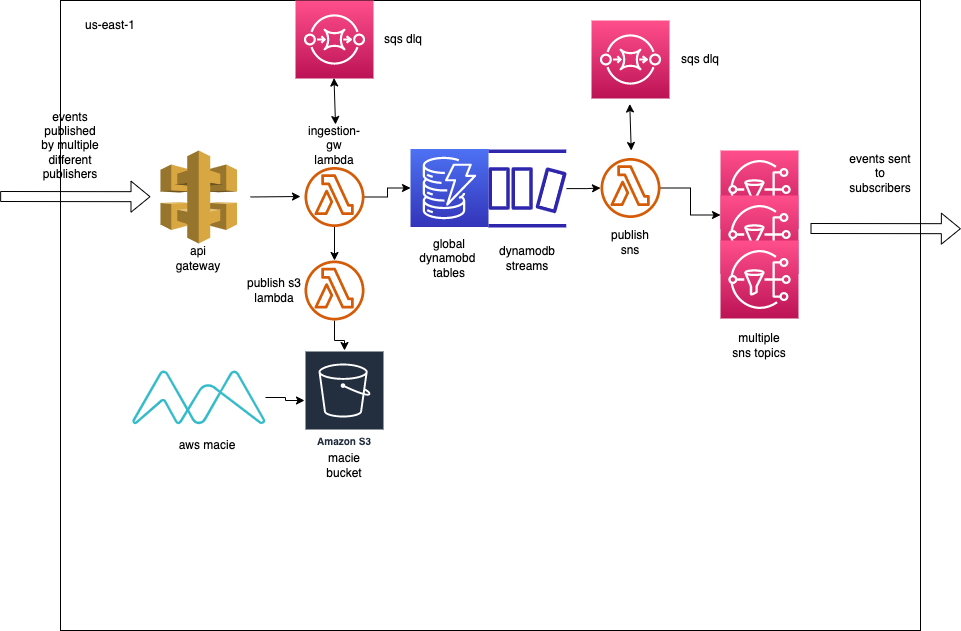

# Pub-Sub Eventing System
  
## Pub-Sub Eventing Diagram

## Summary
This is an example of a pub-sub eventing system.. This diagram is only for `us-east-1` (or any other single region) for simplicity. Third party publishers push events to the `API Gateway`. These events have payloads that are processed by the `Ingestion Gateway Lambda` to go to `DynamoDB`. The `Ingestion Gateway Lambda` also has a `SQS DLQ`. If for some reason the events cannot make it to the `DynamoDB` they are sent to the `DLQ` where they await reprocessing. There is a `CloudWatch Alarm` on the `DQL` so that I know when events are there and can reprocess them quickly. This also allows me to investigate and find out if there are any issues that I need to resolve that would have caused the failure. The `Ingestion Gateway Lambda` also pushes the processed payloads from the `API Gateway` to a `Macie S3 bucket`. This `S3` bucket is where `AWS Macie` will scan and look to see if there is any sensitive information present in the saved payloads. If there is sensitive information present in the payloads, then it will alert and I will speak with the publishers to stop that from happening further. 

Events are saved in `DynamoDB` and then `DynamoDB Streams` begins to be created. These streams invoke a `Publish SNS lambda`. This `lambda` pushes the events from `DynamoDB streams` to a specific `SNS topic` depending on the payload. `Publish SNS lambda` has a `SQS DLQ` also. If there is a failure to push to `SNS` then the events go to the `DLQ`. This `DLQ` has a `CloudWatch Alarm` set up so that if there are any events on the `DLQ` it will alert me. This is again so that I can replay the events quickly and be alerted of any potential issues that need to be resolved before replaying the events. There are multiple `SNS topics` and a subscriber can subscribe to as many as they desire. These `SNS topics` push the events to the subscriber so that the subscriber can do what they need to do with these events (such as sending a text message to the customer).

## Deep Dive

I would like to deep dive into a couple of the resources to give more detail of the design considerations.

### API Gateway

I authenticated the publishers by using API keys. Each publisher had a single API Key that was unique to them. This allowed me to revoke API keys and thus access if needed. It also guaranteed that only those who had been granted API keys could publish to the system. This helped to lock down the system from potential abuse. I also assigned each publisher a usage plan. Having a usage plan for each publisher allowed me to throttle if the publisher began publish something against company rules, such as sensitive customer info. 

### DynamoDB Global Tables

The `DynamoDB` tables are global tables. This allows for 99.999% availability. It also automatically replicates the data between regions, so there is no need to have to write scripts or code to setup the replication. This can also play a key role in disaster recovery between regions.
